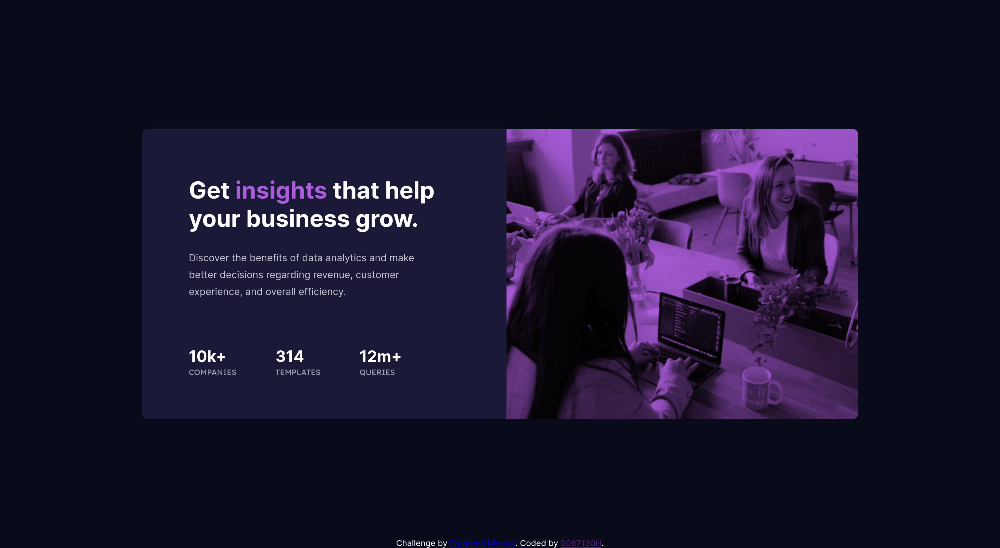

# Frontend Mentor - Stats preview card component solution

This is a solution to the [Stats preview card component challenge on Frontend Mentor](https://www.frontendmentor.io/challenges/stats-preview-card-component-8JqbgoU62). Frontend Mentor challenges help you improve your coding skills by building realistic projects. 

## Table of contents

- [Overview](#overview)
  - [The challenge](#the-challenge)
  - [Screenshot](#screenshot)
  - [Links](#links)
- [My process](#my-process)
  - [Built with](#built-with)
  - [What I learned](#what-i-learned)
  - [Continued development](#continued-development)
  - [Useful resources](#useful-resources)
- [Author](#author)

## Overview

### The challenge

Users should be able to:

- View the optimal layout depending on their device's screen size

### Screenshot



### Links

- Solution URL: [https://www.frontendmentor.io/solutions/stat-preview-card-component-built-using-flexbox-UMEB-YdN5o](https://www.frontendmentor.io/solutions/stat-preview-card-component-built-using-flexbox-UMEB-YdN5o)
- Live Site URL: [https://s067130h.github.io/stats-preview-card-component-main/](https://s067130h.github.io/stats-preview-card-component-main/)

## My process

### Built with

- Semantic HTML5 markup
- CSS custom properties
- Flexbox
- Mobile-first workflow

### What I learned

This section has taught me a lot. One thing about this project that I couldn't figure out for a while was the white space underneath the image inside the figure tag. After a while of researching, I learned images are inline elements and by setting its display property to block, I was able to get the white space to clear out.

Leading into the other section I learned about images as well, I had a difficult time finding the best way to apply an overlay to the image. At first, I tried setting the image to a relative position and moving it to the back with its z-index, then I tried using pseudo-elements as well. Even though they worked, I wasn't completely satisfied with the way they worked. That is when I discovered the *mix-blend-mode* property. This allowed me to blend the image and the background to achieve a result that was close enough to the reference image. In the end, I had an image with the following properties:

```css
img {
	display: block;
	mix-blend-mode: multiply;
}
```
One thing about this project that was holding me up was how I could apply different pictures for the header simply using HTML/CSS. Ultimately, I couldnt find a solution unless I explicitly set the figure container's height and width and used the image as a background. That way I could swap using media queries. In the end, I wrote a small function that is used in the resize window event. This way, once the screen reached below a certain width, the header image would change from the desktop version to the mobile version.

```js
function swapImage() {
	const image = document.querySelector("img");
	if (screen.width >= 1100) {
		image.src = "./images/image-header-desktop.jpg";
	} else {
		image.src = "./images/image-header-mobile.jpg";
	}
}

window.addEventListener("resize", swapImage);
```
Whether this approach is necessary or not, I'm unsure. I am happy with the result regardless. If anyone has any suggestions for how I could implement this without using JavaScript, I'd love to hear all the suggestions!

### Continued development

I would like to work with images more. I tend not to use images often unless it's applied to the background using CSS. Using an actual image in this project opened my eyes to the small quirks of images and some challenges they create when trying to fit them perfectly.

### Useful resources

- [Remove white space below image](https://stackoverflow.com/questions/7774814/remove-white-space-below-image) - This discussion helped me figure out the issue with my image and why the purple background was showing in just a very small amount underneath the image. Once I fixed this, everything was set perfectly.
- [mix-blend-mode](https://developer.mozilla.org/en-US/docs/Web/CSS/mix-blend-mode) - This was a great resource to help me figure out a new method of blending the image and background without creating an overlay using pseudo-elements or using positioning and z-index.
- [Image src Property](https://www.w3schools.com/jsref/prop_img_src.asp) - This resource helped me figure out how to set the image source using JavaScript so I could change images upon resizing of the page.

## Author

- Frontend Mentor - [@S067130H](https://www.frontendmentor.io/profile/S067130H)
